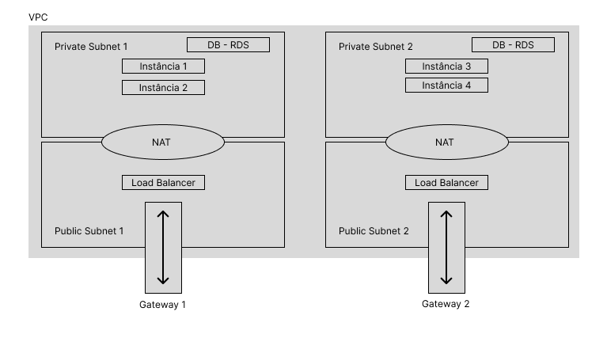

# Documentação do Projeto

## Visão Geral

Este projeto visa a criação de uma infraestrutura na AWS utilizando práticas de Infraestrutura como Código (IaC) com Terraform. A arquitetura proposta inclui a implementação de um Application Load Balancer (ALB), instâncias EC2 gerenciadas por Auto Scaling, um banco de dados RDS, uma aplicação conectada ao RDS e métricas/log utilizando CloudWatch.

## Requisitos Técnicos

### 1. Infraestrutura como Código com Terraform
- Utilização do Terraform para criar e gerenciar recursos na AWS.
- Estrutura modular do código Terraform para separar responsabilidades.
- Armazenamento do estado do Terraform em um bucket S3 para controle de lock.
- Scripts capazes de criar e destruir a infraestrutura sem intervenção manual.

### 2. Application Load Balancer (ALB)
- Provisionamento de um ALB para distribuir o tráfego entre as instâncias EC2.
- Configuração de Target Groups para gerenciar as instâncias EC2.
- Implementação de Health Checks para direcionar o tráfego apenas para instâncias saudáveis.

### 3. EC2 com Auto Scaling
- Criação de um Launch Configuration com uma AMI contendo a aplicação.
- Provisionamento de um Auto Scaling Group (ASG) com base no Launch Configuration.
- Definição de políticas de escalabilidade com base em CloudWatch Alarms.
- Integração do ASG com o ALB por meio do Target Group.

### 4. Banco de Dados RDS
- Provisionamento de uma instância RDS MySQL ou PostgreSQL (configuração db.t2.micro).
- Habilitação de backups automáticos e definição de janela de manutenção.
- Configuração de Security Groups para permitir conexão apenas das instâncias EC2.
- Ativação do Multi-AZ para alta disponibilidade.

### 5. Aplicação
- Desenvolvimento de uma API RESTful ou aplicação web simples.
- Conexão com o banco de dados RDS para operações CRUD.
- Implementação de métricas e logs utilizando CloudWatch.

### 6. Análise de Custo com a Calculadora AWS
- Utilização da Calculadora de Custo da AWS para estimar os gastos mensais.
- Consideração de custos de todos os recursos utilizados e possíveis otimizações.
- Elaboração de um relatório detalhado com previsão de custos e destaque dos principais gastos.

## Diagrama de Arquitetura



## Passos para Executar o Projeto

1. **Configuração do Ambiente**
   - Instale o Terraform e configure suas credenciais AWS.
  
2. **Execução do Terraform**
   - Clone este repositório.
   - Acesse o diretório do projeto.
   - Crie um arquivo `secrets.tfvars`, coloque o arquivo no .gitignore e insira suas credenciais.
      ```
        DB_USER=""
        DB_PASSWORD=""
        DB_NAME=""
      ```
   - Execute os scripts Terraform na seguinte ordem:
     - `terraform init -var-file="secrets.tfvars"` para inicializar o ambiente.
     - `terraform plan` para verificar as alterações planejadas.
     - `terraform apply` para aplicar as mudanças na infraestrutura.
  
3. **Validação da Infraestrutura**
   - Após a execução do Terraform, verifique os recursos criados na AWS.
   - Teste a conexão entre a aplicação e o banco de dados.
  
4. **Análise de Custos**
   - Utilize a Calculadora de Custo da AWS com os parâmetros do projeto para estimar os gastos mensais.
   - Documente os resultados e possíveis otimizações.
  
5. **Documentação**
   - Atualize a documentação técnica com todas as etapas realizadas e decisões tomadas.


### Detalhes de Custos AWS

Este projeto faz uso de uma série de serviços da Amazon Web Services (AWS) para suportar suas funcionalidades. Abaixo estão os custos associados a cada serviço:

#### Amazon EC2
- **Custo Mensal:** 8,47 USD
- **Região:** Leste dos EUA (N. da Virgínia)
- **Detalhes:**
  - Locação: Instâncias compartilhadas
  - Sistema operacional: Linux
  - Carga de trabalho: Consistente (Número de instâncias: 4)
  - Tipo de instância: t2.nano
  - Estratégia de Preços: Compute Savings Plans 3yr No Upfront
  - Monitoramento: Desabilitado
  - Transferência de Dados: Entrada, Saída e Intrarregião (0 TB por mês)

#### Elastic Load Balancing
- **Custo Mensal:** 36,87 USD
- **Região:** Leste dos EUA (N. da Virgínia)
- **Detalhes:**
  - Número de Application Load Balancers: 1

#### Amazon Virtual Private Cloud (VPC)
- **Custo Mensal:** 69,39 USD
- **Região:** Leste dos EUA (N. da Virgínia)
- **Detalhes:**
  - Dias úteis por mês: 22
  - Conexões do Site-to-Site VPN: 1
  - Gateways NAT: 1

#### Amazon RDS for MySQL
- **Custo Mensal:** 62,38 USD
- **Região:** Leste dos EUA (N. da Virgínia)
- **Detalhes:**
  - Armazenamento por instância: SSD de uso geral (gp2)
  - Quantidade de armazenamento: 30 GB
  - Tipo de instância: db.m1.large
  - Utilização (sob demanda): 10% Utilizado/Mês
  - Opção de implantação: Multi-AZ
  - Modelo de preço: OnDemand

#### Amazon Simple Storage Service (S3)
- **Custo Mensal:** 0,00 USD
- **Região:** Leste dos EUA (N. da Virgínia)

#### Amazon CloudWatch
- **Custo Mensal:** 0,90 USD
- **Região:** Leste dos EUA (N. da Virgínia)
- **Detalhes:**
  - GetMetricData: número de métricas

Estes custos são calculados mensalmente com base no uso e nas configurações dos serviços da AWS utilizados neste projeto. Recomenda-se revisar periodicamente esses custos para otimizar o uso dos recursos e garantir eficiência nos gastos. Você pode encontrar mais detalhes sobre os custos no PDF `My Estimate` nesse mesmo repositório (feito utilizando a calculadora da AWS).

## Considerações Finais

Este projeto segue as práticas recomendadas de IaC e oferece uma arquitetura escalável e resiliente na AWS. Certifique-se de revisar regularmente os custos e otimizar conforme necessário para garantir a eficiência operacional.